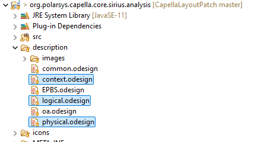
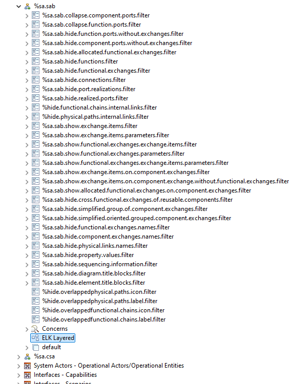
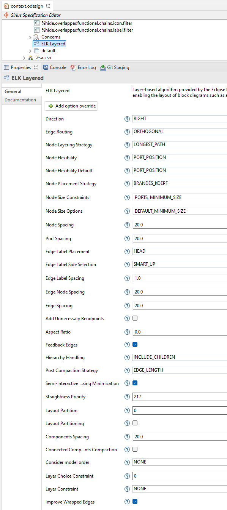
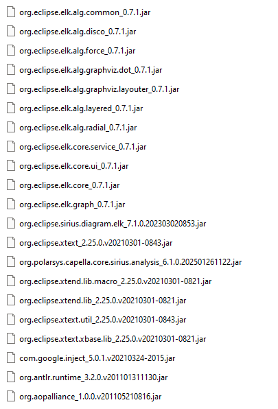
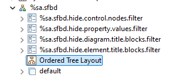
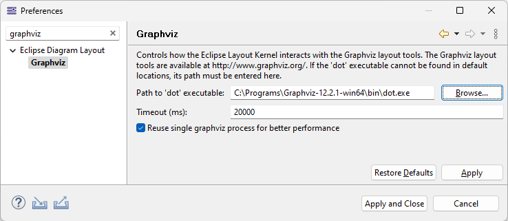
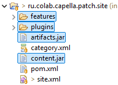

# Developer guide
## File changes overview

The Layot Patch changes the following files in org.polarsys.capella.core.sirius.analysis plugin



In these files for updated diagrams Component layout was changed to ELK Layered layout.



For each updated diagram type properties of ELK Layered layout was experimentally applied and chosen.



The Layout Patch update site contains ELK plugins and some othe dependencies that are needed to install the patch. The following plugins are added into Capella after Layout Patch installation.


## Adjust ELK Layout for current diagrams

If you would like to change somethhing in the ELK layout applied
you can experiment changing ELK Layout Properties and see the layout results.

## Add ELK Layout to other diagrams

You can also try to add ELK layout to other diagrams by editing odesign files by yourself.

You need to fined the diagram definition in the odesign file and remove standard layout.

After that you can add one of the ELK layouts 
	

## ELK algorithms support in the Layout Patch

Currently not all ELK algorihms are added to Capella Patch installation. There are some problems with ELK 7.1 installation into Capella 6.1.0. As a result only some algorithms were chosen that does not result in problems during installation. 

## Graphviz install for Graphviz layouts

Currently only ELK Layered layout is used. If you will try to add some Graphviz layout to diagram specifications you will need to install Graphviz tool on the computer (https://graphviz.org/download/). 

Path to graphviz dot.exe should be also added in the Capella Preferences.
	
	
## How to build from source using maven

To build update site Layout Patch using maven run command in the high level directory of this repository

```code
mvn clean verify
```

## How to build from source using Capella Studio 6.1

tbd 

Download and install Capella Studio 6.1.0
https://www.eclipse.org/downloads/download.php?file=/capella/studio/products/releases/6.1.0

1. Import all plugins and features of the Layout Patch into Capella Studio
2. Set target platform 
3. Open site.xml from rds.capella.patch.site and press Build All
4. Export results into zip archive

