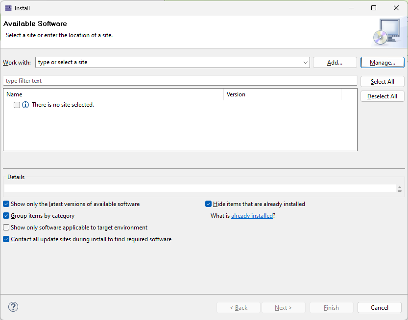
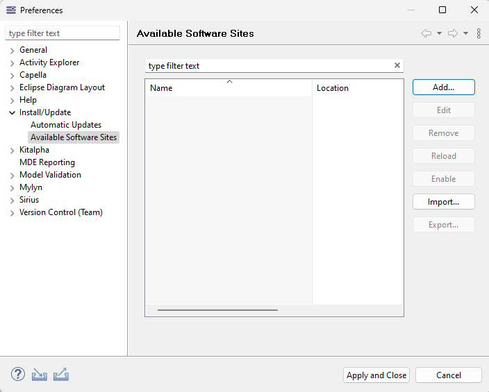
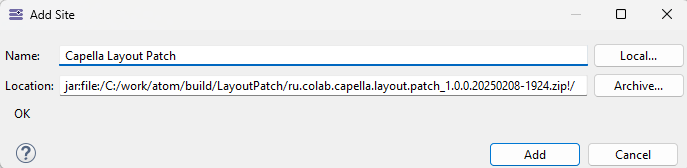
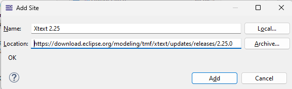
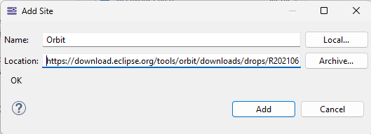
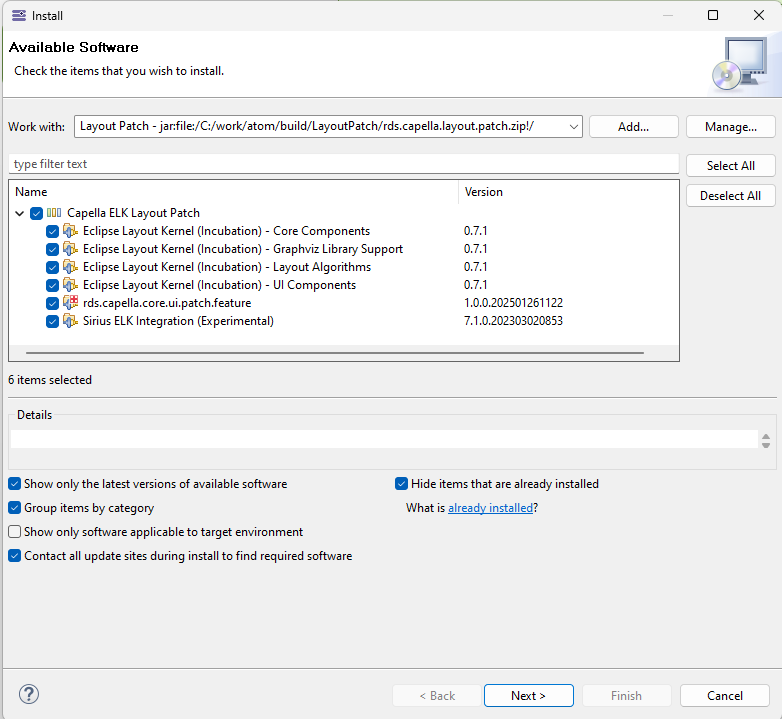
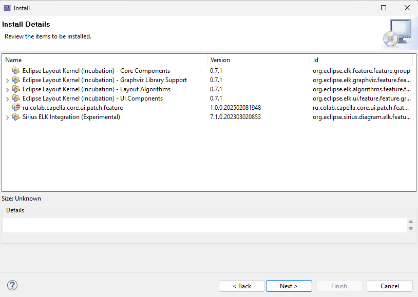
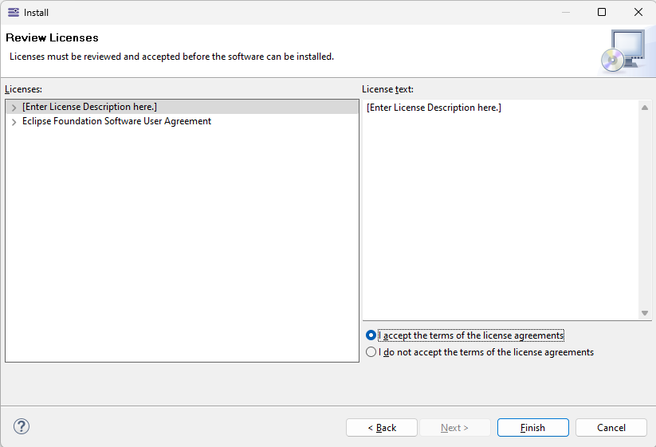
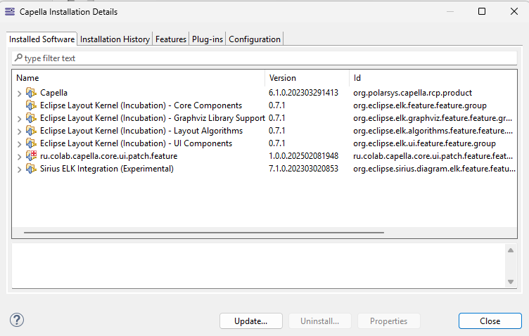

This document contains instructions on how to install Eclipse Capella Diagram Layout Patch into Capella 6.1.0.

 You need to follow 
- Download archive with Layout Patch update site repository (rds.capella.layout.patch.zip);
- Add update sites to Capella
	- add path to local update site with Layot Patch repository;
	- add external upsate sites to Xtext 2.25 and Orbit;
- Run installation wizard and nstall Layout Patch into Capella.

The detailed installation procedure
1. Help > Install New Software
2. In the opened Install dialog press Manage Button 
	
3. In the opened Preferences dialog press Add button 
	
4. In the opened Add Site dialog press Archive and select downloaded archive rds.capella.layout.patch.zip on the disk. After that press the Add button/
   
5. In the Preferences dialog add two external links to update site repositories. And press Apply and Close button.

	![[images/InstallationGuide/AllAddedSites.png]]

	1. Xtext 2.25.0 ( https://download.eclipse.org/modeling/tmf/xtext/updates/releases/2.25.0 )
		

	2. Orbit ( https://download.eclipse.org/tools/orbit/downloads/drops/R20210602031627/repository/ )
		
		
6. In the Install dialog select Work with: Layout Patch and check all features in Capella ELK Layout Patch category and press Next
	
7. In Installation Details page of installation wizard press Next button
	
8. In Review Licenses page of installation wizard press Finish
	
9. In the Security Warning dialog press Install anyway
	![[images/InstallationGuide/SecurityWarning.png]]
10. In the Sofware Updates dialog press Restart Now
	![[images/InstallationGuide/RestartCapella.png]]
11. After restart check that the Layout path was installed in the Help > About Capella > Installation Details Button 
	

After successful installation follow the instructions in [User guide](User%20guide.md) document to apply the layout for diagrams.