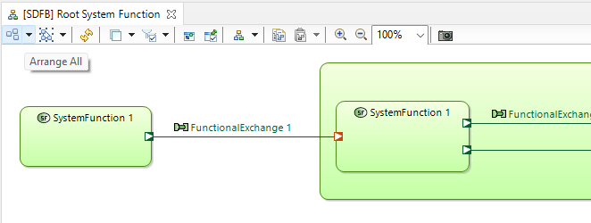

# User guide

The Eclipse Capella 6.1.0 Diagram Layout Patch adds capability to automatically layout some Capella diagrams using ELK layered algorithm. Diagrams with changed layout settings are data flow blank and architecture blank diagrams in SA, LA, and PA phases:

- SA
	- System Data Flow Diagram
	- System Architecture Blank
- LA
	- Logical Data Flow Diagram
	- Logical Architecture Blank
- PA
	- Physical Data Flow Diagram
	- Physical Architecture Blank

To use ELK layouts for a diagram 
- open a diagram
- press the button Arrange All on the digram toolbar

## Known constrains of the ELK layouts

The ELK layered algorithm does not work in some cases for Capella diagrams. For functional data flow diagrams it does not work when a functions chain is shown. For architecture blank diagrams diagrams it does not work when a physical path is shown.

To layout such diagrams you need to remove functions chain \\ physical path from diagram and apply the layot. After that you can add chains or paths to the layouted diagram.

The ELK layered algorithm works incorrectly when for architecture blank diagrams when allocated functions are shown inside components. As a result it changes function sizes to 0. You can use the layout for such diagrams. But need to select all functions and change theirs withs for all after layout applied.

